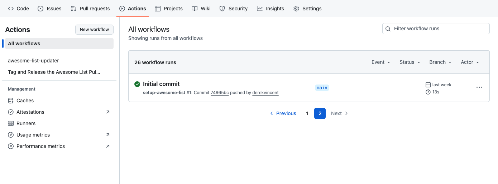
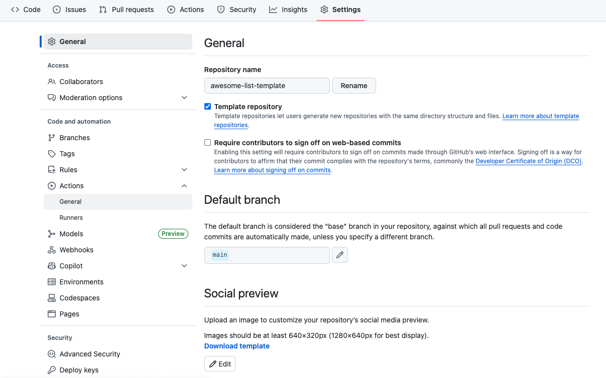
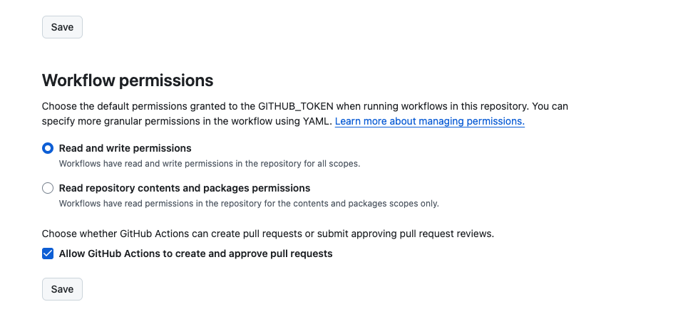
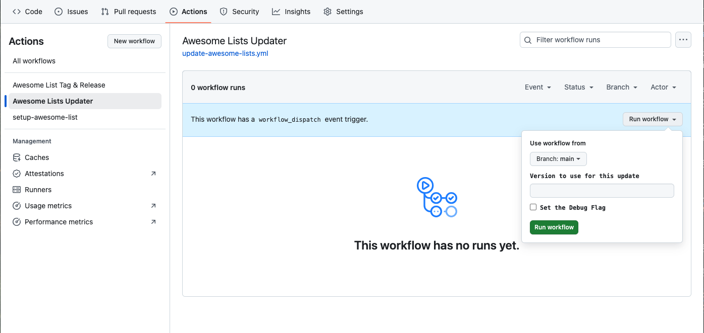

# Create your own Awesome List!

It is awesome that you want to create your own Awesome list. Follow the steps below and in 506 minutes you too can have your own!

1. Create a new repository based on the [awesome-list-template](https://github.com/derekvincent/awesome-list-template/generate).
2. The `setup-awesome-lists` workflow should run automatically to the base layout for the new Awesome lists repository. The workflow status can be checked be viewed be select the `Actions`.    

    

3. Change the new repository workflow settings by going to `Settings` --> `Actions` --> `General` --> `Workflow permissions` and the `Read and write permissions` and `Allows GitHub Actions to create and approve pull requests`.     

    
     
    

4. Run the `Awesome Lists Updater` workflow: `Actions` --> `Awesome Lists Updater` - `Run workflow` (without and inputs). The workflow will run for 2-3 minutes and when it is done will create a pull request for the initial release of the `README.md`. Merger the pull request and publish the draft release.    
   

   

**Congratulations** you have just created you own Awesome List!!! You can now start to edit the `awesome-lists.yaml` file to populate your list. After adapting the configuration and adding some items to your new list you can manually run the `Awesome Lists Updater` from step 4 to re-generate your `README.md` or wait a few for the scheduled action to run automatically. Keeping in mind that the scheduled actions create Pull Requests for each run and need to be manually merged. 

For more information on the `awesome-list.yaml`, properties you can go to the [awesome-lists-generator documentation]().

Also remember to follow the [Awesome manifesto](https://github.com/sindresorhus/awesome/blob/main/awesome.md) and add your new list to the [Awesome project](https://github.com/sindresorhus/awesome/blob/main/create-list.md).